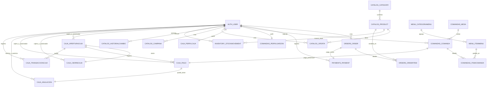

# Esquema del Proyecto y Relaciones Backend

## 1. Vista general del proyecto

Proyecto Django con arquitectura modular. Los modulos activos en `INSTALLED_APPS` son:

- `catalog`: catalogo de productos, categorias, ofertas, campanas y galeria.
- `cart`: carrito de compra.
- `orders`: ordenes de la tienda online.
- `payments`: pagos asociados a ordenes ecommerce.
- `accounts`: autenticacion y cuentas.
- `contact`: contactos y clientes.
- `inventory`: movimientos de stock.
- `menu`: carta digital y items del menu.
- `comandas`: operacion de salon, mesas y comandas.
- `caja`: pagos presenciales, aperturas/cierres y auditoria.

## 2. Flujo funcional por dominio

### Ecommerce

`catalog -> cart -> orders -> payments`

- `Category` agrupa productos.
- `Product` se agrega al carrito y despues a `OrderItem`.
- `Order` pertenece a un usuario.
- `Payment` tiene relacion 1:1 con `Order`.

### Carta y salon

`menu -> comandas -> caja`

- `CategoriaMenu` agrupa `ItemMenu`.
- `Mesa` tiene muchas `Comanda`.
- `Comanda` tiene muchos `ItemComanda`.
- `Pago` en caja tiene relacion 1:1 con `Comanda`.

### Operacion y control

`catalog -> inventory`

- `StockMovement` impacta el `stock` de `Product`.

`comandas -> caja -> transacciones`

- `AperturaCaja` habilita pagos.
- `Pago` queda asociado a una apertura.
- `CierreCaja` cierra una apertura.
- `TransaccionCaja` deja trazabilidad de aperturas, pagos, anulaciones y cierres.

## 3. Tablas y relaciones principales

### Catalogo

- `catalog_category`
  - 1:N con `catalog_product`
- `catalog_product`
  - N:1 con `catalog_category`
  - 1:N con `catalog_oferta`
  - 1:N con `inventory_stockmovement`
  - 1:N con `orders_orderitem`
- `catalog_oferta`
  - N:1 con `catalog_product`
  - N:1 con `auth_user` mediante `creada_por`
- `catalog_campana`
  - N:1 con `auth_user` mediante `creada_por`
- `catalog_historialcambio`
  - N:1 con `auth_user` mediante `usuario`
- `catalog_galeriafoto`
  - sin FK

### Menu y comandas

- `menu_categoriamenu`
  - 1:N con `menu_itemmenu`
- `menu_itemmenu`
  - N:1 con `menu_categoriamenu`
  - 1:N con `comandas_itemcomanda`
- `comandas_mesa`
  - 1:N con `comandas_comanda`
- `comandas_comanda`
  - N:1 con `comandas_mesa`
  - N:1 con `auth_user` mediante `garzon`
  - 1:N con `comandas_itemcomanda`
  - 1:1 con `caja_pago`
- `comandas_itemcomanda`
  - N:1 con `comandas_comanda`
  - N:1 con `menu_itemmenu`
- `comandas_perfilgarzon`
  - 1:1 con `auth_user`

### Caja

- `caja_perfilcaja`
  - 1:1 con `auth_user`
- `caja_aperturacaja`
  - N:1 con `auth_user` mediante `cajero`
  - N:1 con `auth_user` mediante `autorizador`
  - 1:1 con `caja_cierrecaja`
  - 1:N con `caja_pago`
  - 1:N con `caja_transaccioncaja`
- `caja_cierrecaja`
  - 1:1 con `caja_aperturacaja`
  - N:1 con `auth_user` mediante `cajero`
  - N:1 con `auth_user` mediante `autorizador`
- `caja_pago`
  - 1:1 con `comandas_comanda`
  - N:1 con `caja_aperturacaja`
  - N:1 con `auth_user` mediante `cajero`
  - N:1 con `auth_user` mediante `autorizador`
  - 1:1 con `caja_anulacion`
- `caja_anulacion`
  - 1:1 con `caja_pago`
  - N:1 con `auth_user` mediante `solicitado_por`
  - N:1 con `auth_user` mediante `autorizado_por`
- `caja_transaccioncaja`
  - N:1 con `auth_user` mediante `usuario`
  - N:1 con `auth_user` mediante `autorizador`
  - N:1 con `caja_aperturacaja`
- `caja_secuenciatransaccion`
  - sin FK

### Ecommerce y soporte

- `orders_order`
  - N:1 con `auth_user`
  - 1:N con `orders_orderitem`
  - 1:1 con `payments_payment`
- `orders_orderitem`
  - N:1 con `orders_order`
  - N:1 con `catalog_product`
- `payments_payment`
  - 1:1 con `orders_order`
  - N:1 con `auth_user`
- `inventory_stockmovement`
  - N:1 con `catalog_product`
  - N:1 con `auth_user` mediante `authorized_by`
- `contact_contactmessage`
  - sin FK
- `contact_customer`
  - sin FK

## 4. Cuadro visual de relaciones

## 5. Observaciones para mejorar el backend

### 5.1 Separacion de dominios

Hoy existen dos flujos de pago separados:

- `payments.Payment` para ecommerce.
- `caja.Pago` para salon/caja.

Eso esta bien si realmente son dominios distintos, pero conviene documentarlo como decision arquitectonica. Si no, a futuro puede evaluarse una entidad comun de pago base con especializaciones.

### 5.2 Relaciones que faltan

Hay tablas que parecen aisladas y podrian ganar valor con FK:

- `contact.Customer` no se relaciona con `orders.Order`.
- `contact.ContactMessage` no se relaciona con `Customer` ni con `auth_user`.
- `catalog.HistorialCambio` guarda `modelo` y `objeto_id` como texto/numero, pero no FK real.
- `caja.TransaccionCaja` usa `referencia_modelo` y `referencia_id` como referencia generica, sin integridad referencial.

### 5.3 Riesgos de integridad

- `orders.OrderItem.product` usa `SET_NULL`: sirve para conservar historial, pero obliga a guardar nombre/SKU si luego se elimina el producto.
- `comandas.ItemComanda.item_menu` usa `SET_NULL`: correcto para historial, pero ya se compensa con `nombre_item` y `precio_unitario`.
- `inventory.StockMovement.save()` modifica stock al guardar y podria duplicar ajustes si un movimiento se edita luego.

### 5.4 Recomendaciones concretas

1. Agregar una carpeta `docs/` estable para arquitectura y ERD.
2. Definir una convencion de nombres: hoy el proyecto usa `boccato_db`, no `boccato_bd`.
3. Proteger `StockMovement` para que sea inmutable despues de creado, o recalcular stock desde movimientos.
4. Evaluar relacionar `Customer` con `Order` y opcionalmente con `auth_user`.
5. Evaluar `GenericForeignKey` o tablas de auditoria especializadas para `HistorialCambio` y `TransaccionCaja`.
6. Crear indices en FK y campos de consulta frecuente como `estado`, `created_at`, `fecha_inicio`, `fecha_fin`.

## 6. Resumen de la arquitectura backend

La estructura central del backend se divide en cuatro bloques:

- Catalogo e inventario.
- Ecommerce.
- Carta, salon y comandas.
- Caja y auditoria.

El bloque mejor conectado y mas critico es:

`menu -> comandas -> caja`

Ese es el mejor lugar para revisar mejoras de integridad, auditoria y trazabilidad operativa.
